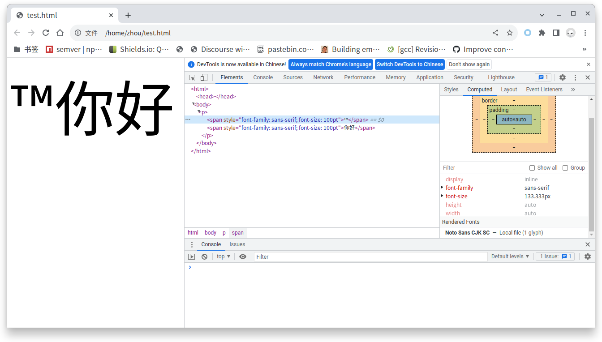

这篇文章是之前两篇关于 fontconfig 文章的后续，前文见第一篇 [fontconfig 几个常见的坑](https://marguerite.su/posts/fontconfig_几个常见的坑)，第二篇 [Color Emoji in openSUSE](https://marguerite.su/posts/color_emoji_in_opensuse)。

偶然在网上看到 Alynx Zhou 的[Fontconfig 和 Noto Color Emoji 和抗锯齿](https://sh.alynx.one/posts/Fontconfig-NotoColorEmoji-Antialias/)里面说看过我的文，没想到我对 fontconfig 的研究在中文圈还是排在前头的 ⌣。原来大家对后续还是有期待的。

先说一下我 2020 年写完那两篇文章干什么去了。我在 Color Emoji in openSUSE 里面不是提到过几个 .rb 代码文件嘛，有些人说找不到它们，其实它们在我的 fork 里面：[marguerite/fonts-config](https://github.com/marguerite/fonts-config)。后来我又重写了 openSUSE 的 fonts-config, 在 [marguerite/fonts-config-ng](https://github.com/marguerite/fonts-config-ng)。可以自动生成 Emoji Glyph 的 Blacklist，也就是 81_emoji_blacklist_glyphs.conf。

但是呢，实际上这种方法在现实中不怎么灵。

    <match target="scan">
      <test name="family">
        <string>Noto Sans CJK SC</string>
      </test>
      <edit name="charset" mode="assign">
        <minus>
          <name>charset</name>
          <charset>
            <int>0x2122</int>
          </charset>
        </minus>
      </edit>
    </match>
 大家可以看到我在 81_emoji_blacklist_glyphs.conf 里面已经有从 Noto Sans CJK SC 字体减除 0x2122（™）这个 charset 的操作了，但是在 Chromium 浏览器中测试是这样的：
 
      <body>
       

         ™
         你好
       

      </body>

那个 TM 码点依然使用 Noto Sans CJK SC 显示。纳尼！TM 不是已经被屏蔽了嘛？

## 简单朴素但不一定对的 fontconfig 工作流假设

以上 charset minus 的方法源于我（可能也是大多数人）的一个朴素假设：

**fontconfig 的工作流程是先扫描(`scan match`)系统上安装的全部字体，生成一个列表，然后通过 pattern match 调整这个列表，最后使用 font match 调整最终列表中字体的属性，返回给调用它的程序使用**。

换句话说，我们假设的是，程序调用 fontconfig 是调用一个完整的工作流，最终返回给程序的字体中没有这个被减掉的 charset。返回的字体可以是 fontconfig 的缓存，也可以是真实的字体但同时返回的字体 charset 属性中没有这个被减掉的 charset，导致程序通过通过 charset 匹配 text 的阶段会失败，从而不去使用这个字体去显示这个字符。

当然了，fontconfig 毕竟不是 fontforge 这样的字体编辑程序，真实的在硬盘上的字体文件里这个字符肯定还是存在的。也许是 fontconfig 在缓存 binary data 的时候就去掉了这个 charset，也许只是在字体属性中去掉了。

但很可惜，这个假设通过我的 debug 发现它，**对也不对**。对的地方是在 fontconfig 自己的 utilities 比如 fc-match, fc-list 里，它是对的。错的地方是在别的程序里，调用方式的不同导致这个工作流**很可能**被掐头去尾取中间了。也就是说别的程序可能只是使用了 fontconfig 的 pattern match 阶段，得到字体就万事大吉了。前面的 scan match、后面的 font match 可能根本就没有用（这个存疑，目前还没有 debug 到这里）。

## 薛定谔的 FontSet

我们前面文章已经说过了，测试 charset minus 方法是否成功的方式有一种是使用：

    fc-list "Noto Sans CJK SC" :charset=0x2122
 
而我还看到过一种方式，就是依云的[
使用 fontconfig 进行字体查询](https://blog.lilydjwg.me/2011/10/23/use-fontconfig-to-query-font.30393.html)。

首先我复制了一份 [fc-list.c](https://github.com/freedesktop/fontconfig/blob/master/fc-list/fc-list.c) 的代码（不到万不得已肯定不能 runtime 改系统的 fontconfig 啊），改了以下地方：

    printf("%d\n", i);
    printf("%d\n", argc);
    printf("%s\n", argv[1]);
    printf("%s\n", argv[2]);
    if (argv[i]) { 
      pat = FcNameParse ((FcChar8 *) argv[i]);
      if (!pat) {
        fprintf (stderr, _("Unable to parse the pattern\n"));
        return 1;
      }
      while (argv[++i]) {
        if (!os) {
          os = FcObjectSetCreate ();
          FcObjectSetAdd (os, argv[i]);
        }
      }
    }
首先我需要知道 fc-lsit 把我的 `Noto Sans CJK SC` 和 `:charset=0x2122` 都识别成什么了。结果是把字体名字识别成 pattern：

     pat = FcNameParse((FcChar8 *) argv[i]);

把  `:charset=0x2122` 识别成了（这里说以下这个冒号就是个语法糖，表示“全部字体”，相当于 `: charset=0x2122`，也可以有别的写法比如 `: family lang`）：

    os = FcObjectSetCreate();
    
然后后面的：

    fs = FcFontList (0, pat, os);
    
得到 FontSet。

FcFontList 会内部调用 `FcFontSetList (config, sets, nsets, p, os);`，这里的 config 是 `config = FcConfigReference (config);`, `sets` 和 `nsets`是 FcFontList 里定义的并传过来的，我们传过来的 `pattern` 和 `objectset` 在这里起到的是筛选的作用，如果 `sets->fonts[n]` 不满足 pattern，loop 就会 continue, 相当于是丢弃了这个 font。

而 `FcFontSetList` 使用 `os` 是在 `if (!FcListAppend (&table, s->fonts[f], os, lang))` (如果没有 os，FcFontSetList 在前面会创建一个空的 os)。这里的 `&table` 是 `FcListHashTable`, 最终是通过 `FcFontSetAdd` 把 table 里的 font 加到 ` ret = FcFontSetCreate();` 这个新建的 FontSet 中并返回这个新建的 ret，作为 FcFontList 返回的 FontSet。

所以这里 `FcListAppend` 的作用是通过 `objectset` 和 `lang` 去判断这个字体可不可以加入到最终的 FontSet。后面再深入的代码我们就不继续看了（最终也是调用到了 `FcPatternObjectFindElt`，看下面 `fc-match` 的分析）。下面是结论：

**通过 `pattern` 和 `objectset` 一起得到的 FontSet 会得到应用了 charset minus 的结果。**

说人话就是**显式地使用 `:charset=0x2122` 就一定会得到精确的含有某个 charset 的字体，即返回结果去掉了减除该 charset 的字体**。不显式使用 `:charset=0x2122` 返回 `Noto Sans CJK SC` 也符合 `fc-list` 的初衷，你不要 charset 只要 Noto Sans CJK SC 肯定会给你返回它。

那么隐式的调用呢？我们来看依云的代码：

      FcFontSet* fs = NULL;
      FcPattern* pat = NULL;
      FcObjectSet* os = NULL;
 
      FcChar8* strpat = (FcChar8*)":lang=zh";
      pat = FcNameParse(strpat);
      os = FcObjectSetBuild(FC_FAMILY, FC_CHARSET, FC_FILE, (char *)0);
      fs = FcFontList(0, pat, os);

他这里的 os 相当于是新建的空 ObjectSet，所以他最终的 FontSet 里面包含了 "Noto Sans CJK SC"。下面的 `FcPatternGetCharSet` 取的 Charset，却包含了 TM 字符：

    if(FcPatternGetCharSet(fs->fonts[i], FC_CHARSET, 0, &cs) != FcResultMatch){

这就有点不对了啊。因为我们如果显式去使用 `objectset`，是对 FontSet 进行修改，如果 FontSet 里的 `Noto Sans CJK SC`含有这个 charset 肯定不会去掉它的。但隐式地先取到 FontSet，再去调用 `FcPatternGetCharset`，得到的结果确是 FontSet 里含有这个 charset。

    FcResult
    FcPatternGetCharSet(const FcPattern *p, const char *object, int id, FcCharSet **c) {
      FcValue	v;
      FcResult	r;

      r = FcPatternGet (p, object, id, &v);
      if (r != FcResultMatch)
	    return r;
      if (v.type != FcTypeCharSet)
        return FcResultTypeMismatch;
      *c = (FcCharSet *)v.u.c;
      return FcResultMatch;
    }

同时，`FcPatternGetCharset` 是一个 get 函数，是不会修改 FontSet 的。

这个留着后续研究了。暂时只能说隐式调用不行。

换句话说，如果想要取得应用 charset minus 方法后的字体，这个程序要改为使用 `objectset`，即：

    int main(int argc, char **argv) {
      FcFontSet* fs = NULL;
      FcPattern* pat = NULL;
      FcObjectSet* os = NULL;
 
      FcChar8* strpat = (FcChar8*)":lang=zh";
      pat = FcNameParse(strpat);
      os = FcObjectCreate();
      FcObjectSetAdd (os, ":charset=0x2122");
      fs = FcFontList(0, pat, os);
    }

## fc-match 分析

双猫的[Linux fontconfig 的字体匹配机制](https://catcat.cc/post/2020-10-31/)对 fc-match 已经有过一些分析了，比如 FcConfigSubstitute 是最重要的函数。

fc-match.c 一开始还是跟 fc-list.c 一样的，常规解析 `pattern` 和 `objectset`。

然后是调用：

    FcConfigSubstitute (0, pat, FcMatchPattern);
    FcDefaultSubstitute (pat);
    
    fs = FcFontSetCreate ();

再往下是双猫说过的分别针对 sort/all 和默认 match 的处理，主要是调用 `FcFontSort` 和 `FcFontMatch`得到 font_pattern，然后通过 `FcFontSetAdd` 加入到 FontSet。

然后是针对得到的 FontSet 逐个的应用 `FcPatternFilter`：

    font = FcPatternFilter (fs->fonts[j], os);
     
`FcPatternFilter` 函数里最重要的是：

    e = FcPatternObjectFindElt (p, object);
    if (!e)

而 FcPatternObjectFindElt 里最重要的函数是 `FcPatternObjectPosition`。

这个 `FcPatternObjectPosition` 听名字也能知道它是查找属性的。`:charset=0x2122` 找不到，

    fc-match -s sans-serif :charset=0x2122
    
就会返回空了。

以上分析说明了我们前面关于 `ObjectSet` 的论断是正确的，显式的给，它才会用。同时也说明了，在 fontconfig 自己这边，charset minus 方法是部分尊重的。

但还是没有能够说明 FontSet 里时在时不在的 charset 问题。也引入了更多的问题，比如，fc-match 里面没有看到 `FcFontList` 函数，它的 FontSet 完全是根据 `FcConfigSubstitute` 的结果做的。那么系统上的字体是在 FcConfigSubstitute 的哪步加进来的呢？

我们也看到了加了 `ObjectSet` 去匹配是返回空的，也就是说，我们的 FontSet 里面的字体应该是没有 `charset=0x2122` 这个字符的。FontSet 肯定是系统上安装的真实字体形成的，那么是哪步把这个 charset 删掉的呢？在缓存时？还是在字体属性里？而且这中间只经历了一次 `FcConfigSubstitute`，是不是可以说 `FcConfigSubstitute` 本身在进行 pattern match 的时候就也应用了 scan match 和 font match 的规则呢？ 

## Chromium/Chrome 在 Linux 上查找字体的方式

这个是双猫的[Linux fontconfig 的字体匹配机制](https://catcat.cc/post/2020-10-31/)缺少的 Chromium 代码部分。之前 V2EX 上有个 rant [Chrome 把 FreeTyoe/Fontconfig 全集成进自己沙盒以及扣肉满天下简直毒瘤到爆表!](https://www.v2ex.com/t/853093)，说得不完全对，至少在我要 debug 的问题上，我不需要知道 skia 究竟干了什么，我只需要知道 chromium 最终是怎么在 Linux 上查找 Fallback 字体的就可以了。于是，我找到了 [ui/gfx/font_fallback_linux.cc](https://github.com/chromium/chromium/blob/main/ui/gfx/font_fallback_linux.cc)，里面有一个最重要的 `GetFallbackFont` 函数，它有关 fontconfig 部分的代码是这样的：

    FcConfig* config = GetGlobalFontConfig();
    FcConfigSubstitute(config, pattern.get(), FcMatchPattern);
    FcDefaultSubstitute(pattern.get());
    FallbackFontEntries fallback_font_entries;
    FcResult fc_result;
    FcFontSet* fonts = FcFontSort(config, pattern.get(), FcTrue, nullptr, &fc_result);
    if (fonts) {
      // Add each potential fallback font returned by font-config to the
      // set of fallback fonts and keep track of their codepoints coverage.
      for (int i = 0; i < fonts->nfont; ++i) {
        FcPattern* current_font = fonts->fonts[i];
        if (!IsValidFontFromPattern(current_font))
          continue;

        // Retrieve the font identity fields.
        base::FilePath font_path = GetFontPath(current_font);
        int font_ttc_index = GetFontTtcIndex(current_font);

        // Retrieve the charset of the current font.
        FcCharSet* char_set = nullptr;
        fc_result = FcPatternGetCharSet(current_font, FC_CHARSET, 0, &char_set);
        if (fc_result != FcResultMatch || char_set == nullptr)
          continue;

        // Retrieve the font render params.
        FontRenderParams font_params;
        GetFontRenderParamsFromFcPattern(current_font, &font_params);

        fallback_font_entries.push_back(FallbackFontEntry(
            font_path, font_ttc_index, font_params, char_set));
      }
      FcFontSetDestroy(fonts);
    }

可以看到，它跟 fc-match 差不多，调用了 `FcFontSort` 后得到了 FontSet，然后再逐个的 `FcPatternGetCharSet`。

按照我们前面的分析，如果 `FcConfigSubstitute` 得到的这个 FontSet 里是进行过 charset minus 的，那么 `FcPatternGetCharSet` 是 100% 尊重的，就不会出现之前的用 `Noto Sans CJK SC` 显示 TM 符号的情况。

看来我们要继续分析 `FcConfigSubstitute` 的实现了。

未完待续。
