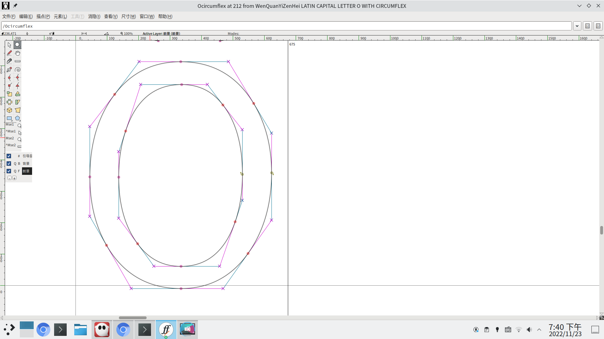

最早是 openSUSE 中文论坛上的一个帖子[疑似文泉驿字体BUG](https://forum.suse.org.cn/t/topic/13044/29)把我带入字体的坑的，以前我只是停留在玩 fontconfig 的阶段。为了解决这个BUG，我简单的学习了一下 fontforge，发现带草字头和竹字头的字形简直是太多了，绝对不能手改，于是萌生了编程化地解决这个BUG的想法。接着无意中就把文泉驿的 ttc 转成了 ufo3 格式，并且在 README.md 中发愿要使用 googlefonts 的 fontmake 工具来编译文泉驿。

其实当初没有想那么多的，转换成 ufo3 格式并使用 fontmake 来编译文泉驿有什么好处呢？首先文泉驿作为一个中古字体（只能说比什么 UMing 之类的要新一点），它一直以来不是那么开源的。我理解的开源要有源代码，作为普通用户我很难去把 ttc 当成是源代码的（当然对于会 fontforge 的人来说 ttc 就约等于源代码），我理解的源代码就是能作为文本打开的。wenq.org 曾经是有一个在线编辑器的，用户们可以众筹在线编辑字形，FangQ 会在后台把用户编辑的字形搜集起来去做新的 ttc。随着时间，这套机制已经是废弃了的，也就可以说我们无法再获取到它的源代码了。把文泉驿转存成 ufo3 格式，它的每一个字形都是文本化的 glif 格式，相当于复现了源代码。有了源代码一切都好办了，未来我们还可以再制作在线编辑器，让文泉驿原来的模式继续下去。其次使用 fontmake 来编译文泉驿，相当于让文泉驿与所有现代字体比如 Noto Sans CJK 又站在了同一起跑线上。最近几年字体制作发展的很快，前几年我在 github 上是很少能看见字体项目的，但自从 Adobe 和 Google 在 github 上开源了他们的一些字体工具后呢，现在各种拼接字体大行其道了，比如更纱黑体这种，甚至偶尔还会给我推送一些做原创字体的项目。这些曾经都是与文泉驿无缘的，正如我所说的，大多数人不认为 ttc 是源代码，所以没法利用文泉驿。但现在好了，我可以用 fontmake 编译文泉驿，就表示说 fontbakery 我也可以用，ttfautohint 我也可以用，换句话说，如果我的 ufo3 格式通过了 fontbakery 的 adobefonts 或 googlefonts 的系列检查，且不论字形美丑，至少在字体质量上当年手搓出来的文泉驿是可以进化到 Noto Sans CJK 的水平的。

大多数工作是两年前做的，当时我写了一个 [ufo3](https://github.com/marguerite/wenq/ufo) 的解析库，修复了草字头和竹字头的问题，并且使用 fontforge 再次生成了 ttf 字体。后来去打包 fontmake 的时候遇到了 skia-pathops 的编译问题，项目就停滞了，甚至草字头和竹字头的问题最终也没有反馈回发行版中。

最近闲来无事反过来看 skia-pathops 的打包，这次我认真了些，发现它并不需要完整的 skia，虽然看上去很吓人。于是经过修复后，skia-pathops 打包成功了（python3 相关的补丁可以去我 OBS 上 `home:MargueriteSu:fontmake/skia-pathops` 工程里找），我接着又更新了 fontmake 的打包。下面新的问题来了：

https://stackoverflow.max-everyday.com/2020/02/ufo2ft-filtersrunning-removeoverlapsfilter/

跟这个人遇到的一样，我先是使用了 `--overlaps-backend pathops` 来解决 qcurve 的问题，然后遇到了同样的错误：

    pathops._pathops.PathPen._qCurveToOne
    TypeError: 'NoneType' object is not subscriptable
 

结果这个人到这里就结束了，不再继续深入研究了。困扰了几天，还是决定看代码自己搞定。先是在 `ufo2ft/filters/removeOverlaps.py` 里面加了：

    try:
        print(glyph.name)
        self.union(contours, pen)
    except self.Error:
        logger.error("Failed to remove overlaps for %s", glyph.name)
        raise

至少能告诉我问题出在哪个字形，然后又在 `fontTools/pens/pointPen.py` 里加了：

    elif segmentType == "qcurve":
        print(points)
        pen.qCurveTo(*points)
        lastPt = points[-1]

结果发现还没调用 skia-pathops 的 Cython 函数前 points slice 最后就被加上了 None。长出了一口气，因为 C/C++ 的 debug 我确实不太行。后来就找到了 `fontTools/pens/pointPen.py`#Line129 ：

    else:
            # It's a closed contour. Locate the first on-curve point, and
            # rotate the point list so that it _ends_ with an on-curve
            # point.
            firstOnCurve = None
            for i in range(len(points)):
                segmentType = points[i][1]
                if segmentType is not None:
                    firstOnCurve = i
                    break
            if firstOnCurve is None:
                # Special case for quadratics: a contour with no on-curve
                # points. Add a "None" point. (See also the Pen protocol's
                # qCurveTo() method and fontTools.pens.basePen.py.)
                points.append((None, "qcurve", None, None, None))

这里的逻辑是如果没有 on-curve point，就会添加一个 X 和 Y 都是 None 的 qcurve。可是 X 和 Y 都是 None 它不是一个点啊...于是 skia-pathops 后续就出错了。那么下一步就是了解什么是 on-curve point 了。我知道 ufo3 格式里 glyph（字形）包括 contour（部件），contour 是由 point（点）组成的，点也有类型 Type，但是我并没有找到一个叫做 on-curve 的类型，相反类型有 offcurve 、curve 和 qcurve。于是我就想当然理解 curve 就是 on-curve（也没错），qcurve 既然是一种特殊的 curve，那它自然也是 on-curve 的点。

下一步就是确定把这个 contour 里的哪个点改成 qcurve 了。一个 glif 文件的 contour 长这样（以曾出错的 uni0275.glif 为例）：

    <contour>
      <point x="43" y="393"/>
      <point x="180" y="543"/>
      <point x="408" y="543"/>
      <point x="545" y="393"/>
      <point x="545" y="139"/>
      <point x="408" y="-10"/>
      <point x="180" y="-10"/>
      <point x="43" y="139"/>
    </contour>
    

于是我尝试了各种排列组合给这个出错的点集合的某个点变成 qcurve，但发现不管我怎么变，最终导入到 fontforge 都不是椭圆形，总有一个地方是尖角，差一点就放弃了。这里说一下你可以随便打开个字体，然后使用 fontforge 的导入功能去导入 glif 文件，会替换当前字体的某个字形，然后就能用 fontforge 预览效果了。

尝试了很久，比如在 github 上搜别人的 uni0275.glif，都失败了。最终是打开了文泉驿里面别的椭圆字形（例如 Ocircumflex.glif），看到了它最下部的点的做法才恍然大雾。

原来 fontmake 喜欢的是好比两个 相邻的 X 相同或 Y 相同的点，中间要有一个点做 qcurve 这样子画圆。上面的 contour 是最精简的点集合，我们无论改哪个点的 type 都会导致成不了椭圆，但 fontmake 是不认的。最终通过简单的三角计算我们补全这个 contour 成这样：

    <contour>
      <point x="43" y="266" type="qcurve" smooth="yes"/>
      <point x="43" y="393"/>
      <point x="111" y="468" type="qcurve" smooth="yes"/>
      <point x="180" y="543"/>
      <point x="294" y="543" type="qcurve" smooth="yes"/>
      <point x="408" y="543"/>
      <point x="477" y="468" type="qcurve" smooth="yes"/>
      <point x="545" y="393"/>
      <point x="545" y="266" type="qcurve" smooth="yes"/>
      <point x="545" y="139"/>
      <point x="477" y="64" type="qcurve" smooth="yes"/>
      <point x="408" y="-10"/>
      <point x="294" y="-10" type="qcurve" smooth="yes"/>
      <point x="180" y="-10"/>
      <point x="111" y="64" type="qcurve" smooth="yes"/>
      <point x="43" y="139"/>
    </contour>
    
 编译过了。但是问题来了，这样的椭圆在文泉驿里面有很多啊，于是编程化字体开发又来了。我写了一个 `append_qcurve_point_to_closed_contours.go` 的 fix，批量处理一下。终于编译成字体了。
 
 过了 17 年，文泉驿终于在我手里发布了 0.9.48 版本，发布的是 otf-cff2，可以利用 adobe 给 freetype2 的最新的那个光栅器。新的版本发布在 https://github.com/marguerite/wenq/releases。同样也有传统的 ttf 版本。ttc 就不发布了，因为文泉驿的 ttc 是有毛病的，或者说 ttc 这个标准就是有毛病的，微软发布的标准说 table 必须都能够被 4 整除，结果它自己的字体使用的标准是整个字体可以被 4 整除，不足的自动用 0 补齐。
 
 下一步就是几个方向：第一个是打包 fontbakery 让文泉驿真正满足 Google Fonts 的标准，第二个是把 ufo3 转成 glyphs 格式，这样可以生成 variable fonts，第三个是编程化的查找缺字，并使用已有的 contour 缩放去补齐，后端写好了也许会找个人写个拼字游戏的前端来把文泉驿最早的那个在线编辑器复活。
